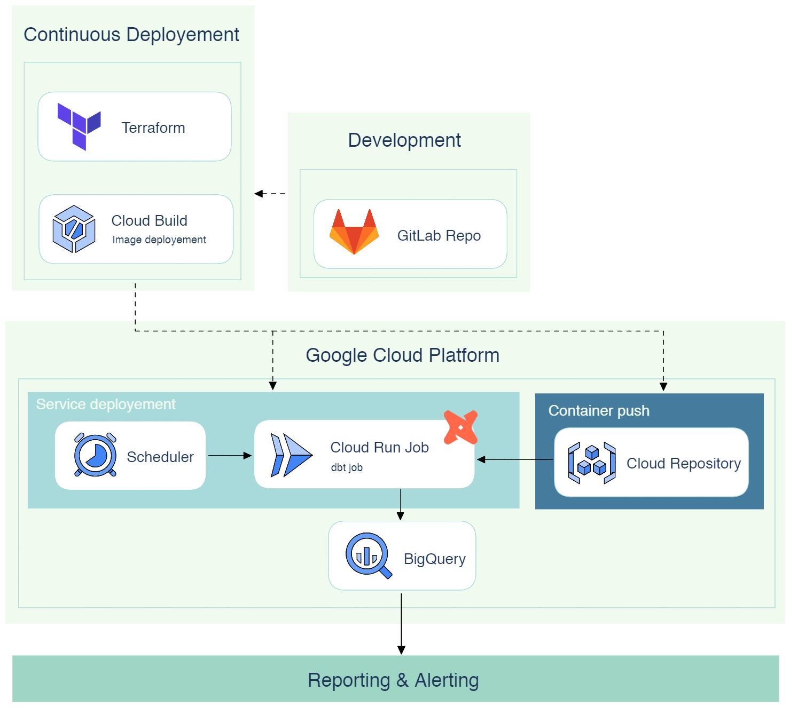

# dbt-serverless processing service

dbt serverless service is a template repository for deploying scheduled serverless dbt framework based processing on GCP infrastructure

```

    .______.    __                                                   .__                        
  __| _/\_ |___/  |_            ______ ______________  __ ___________|  |   ____   ______ ______
 / __ |  | __ \   __\  ______  /  ___// __ \_  __ \  \/ // __ \_  __ \  | _/ __ \ /  ___//  ___/
/ /_/ |  | \_\ \  |   /_____/  \___ \\  ___/|  | \/\   /\  ___/|  | \/  |_\  ___/ \___ \ \___ \ 
\____ |  |___  /__|           /____  >\___  >__|    \_/  \___  >__|  |____/\___  >____  >____  >
     \/      \/                    \/     \/                 \/                \/     \/     \/
                                                                      
```

## Architecture


# Installation

## Adapt the dbt project config files & models
1. Clone the repository
2. Modify or upload your dbt projects folder into the `service/dbt-service/project` directory. 
> Values to be replaced are flagged by a `#TO MODIFY` placeholder
3. Modify or upload your dbt [profiles.yml](services\dbt-service\profiles\profiles.yml) file into the `service/profiles`, make sure the project is refered as dbt_process
> Values to be replaced are flagged by a `#TO MODIFY` placeholder


## Connect your local environment to GCP using GCP CLI

If you are running this on your local computer, or on a newly provided environment that doesn't have Google Cloud CLI installed, install it [google cloud CLI](https://cloud.google.com/sdk/docs/install)

If your terminal is not already connected to GCP. Run the following commands, 

```sh
    gcloud auth application-default login
    gcloud auth login
```

Follow the instructions to login to your GCP project

## Run initial tests

Ensure the dbt project is properly set up:
```sh
cd `service/dbt-service/` 
```

Run these commands one after the other
```sh
dbt run --models initial_run.* --project-dir project --profiles-dir profiles &&
dbt test --project-dir project --profiles-dir profiles &&
dbt run --models data_checker.*  --project-dir project --profiles-dir profiles
```

Once everythin has run, you should end up with 3 different dataset in your BigQuery projects. The first one mimics input data, the second one runs audit on the input data and the last one aggregate the results of the audit in a unique table.

## Build the dbt docker image

Now that everythin is properly set up locally, you are ready to build and push the docker image containing your dbt project.
the dbt-service folder aims to be packaged into a docker image running in a container. Cloud Build is used to push the docker image in Google Container Registry.

Run the following command to push the docker image to gcr.

```sh
gcloud builds submit --project <my_gcp_project>
```

At the end of this step, you can verify that the docker image has been properly built in Google Container Repository

>Make sure the name of the image corresponds to the one that is set up in the [terraform config](jobs.tf)

## Set up Google Cloud services using terraform
Terraform is used to deploy every other services used by this project, it includes:
- IAM service account
- Storage bucket
- Cloud Scheduler
- CloudRun Job

To deploy the services, run the command in the following order.
Make sure [terraform](https://developer.hashicorp.com/terraform/tutorials/aws-get-started/install-cli) is installed on your local machine.

```
terraform init
terraform plan
terraform apply
```

# Variables and configs


dbt variables cannot be modified in the current version of the infrastructure
you can create custom dbt variables from the [dbt_project.yml](services\dbt-service\project\dbt_project.yml) config file


## Scheduling runs
By default, the runs will be scheduled on a daily basis at 6am based on the following json exported to cloud scheduler.
You can change the scheduling in the terraform configs located in [terraform config](jobs.tf)

# Built in tests
This package comes in with a pre-built library of generic SQL tests.
[Check the tests documentation](docs/tests.md)

# Debugging

[Check the debug documentation](docs/debug.md)


