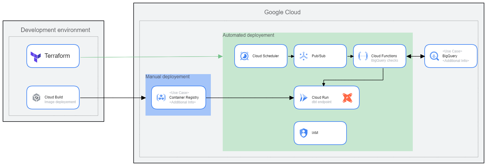

# dbt-serverless processing service

dbt serverless service is a template repository for deploying scheduled serverless dbt framework based processing on GCP infrastructure

```

    .______.    __                                                   .__                        
  __| _/\_ |___/  |_            ______ ______________  __ ___________|  |   ____   ______ ______
 / __ |  | __ \   __\  ______  /  ___// __ \_  __ \  \/ // __ \_  __ \  | _/ __ \ /  ___//  ___/
/ /_/ |  | \_\ \  |   /_____/  \___ \\  ___/|  | \/\   /\  ___/|  | \/  |_\  ___/ \___ \ \___ \ 
\____ |  |___  /__|           /____  >\___  >__|    \_/  \___  >__|  |____/\___  >____  >____  >
     \/      \/                    \/     \/                 \/                \/     \/     \/
                                                                      
```

## Architecture


# Deployement

## Adapt the dbt project config files & models
1. Clone the repository
2. Modify or upload your dbt projects folder into the `service/dbt-service/project` directory. 
3. Modify or upload your dbt profiles.yml file into the `service/profiles`, make sure the project is refered as dbt_process

## Connect your account to GCP

If your terminal is not already connected to GCP. Run the following commands, make sure you've installed the [google cloud CLI](https://cloud.google.com/sdk/docs/install)

```sh
    gcloud auth application-default login
    gcloud auth login
```

Follow the instructions to login to your GCP project


## Build the dbt docker image

the dbt-service folder aims to be packaged into a docker image running in a container. Cloud Build is used to push the docker image in Google Container Registry.
Run the following command to push the docker image to gcr.

```sh
gcloud builds submit --project <my_gcp_project>
```

## Set up Google Cloud services using terraform
Terraform is used to deploy every other services used by this project, it includes:
- IAM service account
- Storage bucket
- Cloud function 
- PubSub topic
- Cloud Scheduler
- CloudRun

To deploy the services, run the command in the following order.
Make sure [terraform](https://developer.hashicorp.com/terraform/tutorials/aws-get-started/install-cli) is installed on your local machine.

```
terraform init
terraform plan
terraform apply
```

# Variables and configs
Variables and config files are retrieved from the storage bucket and downloaded to the running dbt container.
To make the files available in storage, we recommend setting up github actions to upload the following files or folders to the storage bucker:
- `dbt-service/project/models`
- `dbt-service/project/tests`
- `dbt-service/variables.yml`
- `dbt-service/project/dbt_project.yml`
- `dbt-service/profiles`

## Creating dbt variables

one of the main disadvantage of dbt is that it doesn't handle python variables. One way to overcome this issue is to use the eval() function on top of string type python variables to generate vars configs.

vars configs are located in the `dbt-service/variables.yml` file and exported to the `variable/` GCS bucket. An example of this file is displayed below.

```yml
my_var_1: '123'
my_var_2: 'datetime.date.today()'
```
At start, the docker container will translate the variables into readable strings to create the following file, which will be taken as an input of dbt models and tests.

```yml
my_var_1: 123
my_var_2: 2023-02-20
```

>note that to be used within a model or a test, dbt variables must be called in a jinja2 language such as  `{{var("my_var_2")}}`
### Regenerate the vars
If you've added new vars to be evaluated and translated through the python function, you can run the following command tu update the `project/vars/` folder

```sh
import evaluate_vars
evaluate_vars.generate_variable_file('variables.yml', 'project/vars/project_vars.yml')
```

## Export the models
Upload the content of the `project/models/` to the corresponding bucket
Note that it is recommended to implement a CI/CD for exporting these files

## Export the profiles
Upload the content of the `profles/` to the corresponding bucket
Note that it is recommended to implement a CI/CD for exporting these files

## Scheduling runs
By default, the runs will be scheduled on a daily basis at 6am based on the following json exported to cloud scheduler.
Note that you can add as many command as you like. Here are displayed the two common commands `dbt test` and `dbt run`, sent in a loop to the cloudRun container.

e.g.
```json
{
    "--profiles-dir":"profiles",
    "--project-dir":"project",
    "cli":"test",
    "endpoint":"https://dbt-service-xxxxxxxxx-ew.a.run.app/run"
},
{
    "--profiles-dir":"profiles",
    "--project-dir":"project",
    "cli":"run",
    "endpoint":"https://dbt-service-xxxxxxxxx-ew.a.run.app/run"
}
```
# Built in tests
This package comes in with available generic SQL tests.
[Check the tests documentation](docs/tests.md)

# Debugging

[Check the debug documentation](docs/debug.md)


